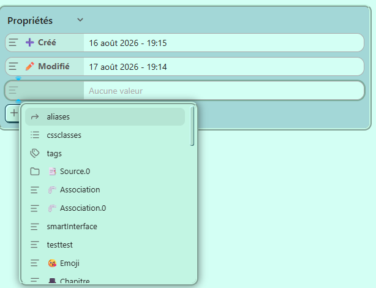
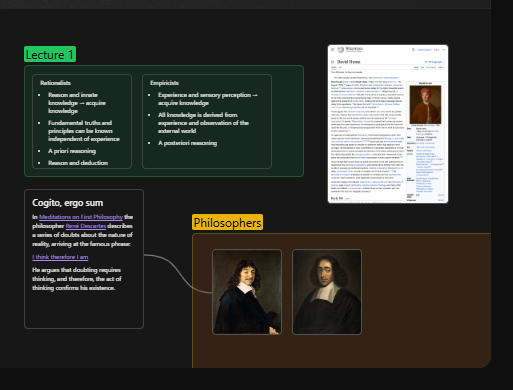
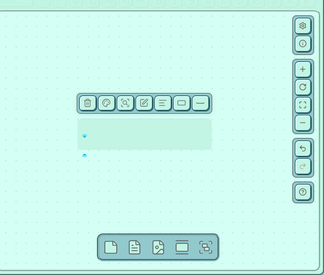
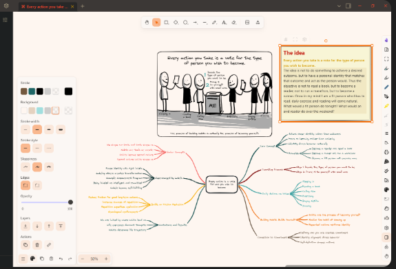
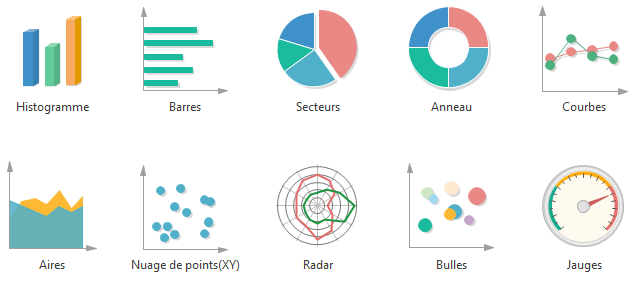
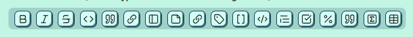
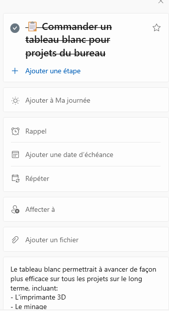
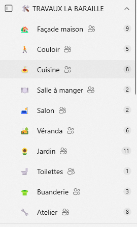

### //////////////////////////////////////////////////////////////////////////
### //                           📋 ToDo.md                                 //
### //////////////////////////////////////////////////////////////////////////

Pour te faire une idée d'à quoi ressemble Obsidian voici plusieurs sources sur lesquelles te baser pour avoir une perspective avancée de mon application:
Anecdote:
Bien que Capacities ait une interface qui ne correspond pas vraiment à mes besoins car j'ai quand même besoin:
- D'organiser ce que je fais par dossiers
- Utiliser les notes pour des choses plus variées comme des canvas, des plans, etc... Que juste des catalogues et bases de données md.
Je trouve son système d'automatisme de propriétés, son concept "d'objets" ainsi que sa façon d'organiser tout est mieux pensé que ce que fait Obsidian avec ses fichiers simples. C'est une bonne source d'inspiration pour les propriétés, la recherche ainsi que la vue graphique:
https://docs.capacities.io/tutorials/getting-started#no-files-no-folders-just-objects-and-object-types

//////////////////////////////////////////////////////////////////////////
 #### Chap 1. ⚙️ Interface générale et paramètres
//////////////////////////////////////////////////////////////////////////

##### //1. 👋 L'APPARENCE DE L'ACCUEIL
###### - Barres lattérales:
On peut non seulement choisir d'élargir/affiner la barre lattérale droite, mais aussi les barres lattérales gauche. Le but est de maximiser le confort de l'utilisateur envers l'interface.

##### //2. 🗃️ EXPLORATEUR DE FICHIERS
L'explorateur de fichiers est ce qui permet de gérer et organiser les fichiers
###### - Organisation:
Un bouton se situe en haut de l'explorateur afin de pouvoir organiser tout dans un ordre:
-> Alphabétique
-> Plus/moins récent
-> Personnalisé (déplacer manuellement les fichiers où et comme nous le  souhaitons dans le vault en sélecttionnant avec le curseur).
/!\ Si l'ordre choisi était personnalisé et qu'on choisit d'organiser autrement, cela va complètement bouleverser l'ordre qu'on avait déjà établi.
Source d'inspiration:
[https://obsidian.md/help/plugins/file-explorer]
https://community.obsidian.md/plugins/make-md
###### - Système de recherche:
La recherche est un petit bouton en haut de la gestion de fichiers. Dedans, on peut chercher cce qu'on souhaite (fichiers, attachements, mots clés) à l'aide du bouton 'filtre' nous faisant choisir par propriétés.
https://community.obsidian.md/plugins/omnisearch
https://obsidian.md/help/plugins/search

##### //3. 🧰 COFFRE
Le coffre sont des sortes de différents espaces de travail qu'on peut avoir au sein de l'application, synchronisables par email.

##### //4. 🪢 VUE GRAPHIQUE
La vue graphique est une vue avec l'apparence d'un système de neuronnes qui montre les liens des fichiers qu'on a créé avec les liens internes.
https://obsidian.md/help/plugins/graph
###### - Comportement et apparence:
La vue graphique peut être en 3D. Si on sélectionne un noeud (qui représente donc une fiche), le noeud s'aggrandit et la barre latérale montre toutes les propriétés que ce fichier possède.
###### - Personnalisation:
On ouvre la vue graphique peut s'afficher en grand à partir de la barre latérale droite et on peut la personnaliser à l'aide de ces éléments qui apparaîtront sur cette dernière:
-> Les filtres (par propriétés)
-> Les groupes (pouvoir choisir leur couleur et leur propriété)
-> L'affichage (taille des noeuds, seuil du fondu du texte, l'épaisseur des liens, la présence de flèches...)

##### //5. 🗄️ PROPRIETES
Configurables et ajoutables en haut des fichiers que nous avons créé à l'aide d'un '+'.
Si on appuie sur le +, cela engendre une petite barre de suggestion de toutes les propriétés existantes.
On choisit à gauche la propriété qu'on souhaite, et on écrit à droite ses données (si elles ne sont pas déjà prédéfinies elles-mêmes par la propriété en question)
Lien d'inspiration: [https://obsidian.md/help/properties]

###### - 🏷️ Mots-clés:
Les mots-clés sont des mots avec un # qui permettent de facilement retrouver des fichiers lorsqu'on ne se souvient plus de leurs noms. Ils ne peuvent pas posséder de symboles, ni d'espaces.
Lien d'inspiration: [https://obsidian.md/help/tags]
###### - Dates: 
###### - Chemin: 
###### - Format: 
###### - Alias:
###### - Objets:
###### - 🔏 Secrets:
Une propriété étant une fonction boolean qui permet à verrouiller un fichier au choix. Pour les débloquer, il faut un mot de passe.

//////////////////////////////////////////////////////////////////////////
#### Chap 2. Les types de formats
//////////////////////////////////////////////////////////////////////////

##### //1. 📄 LES FICHIERS
J'ai choisi fichier mdx afin qu'on puisse à la fois écrire et ajouter des boutons et une forme d'interface directement sur notre fiche si on le souhaite.
###### - Hiérarchie:
Il est possible d'ajouter une hiérarchie entre certaines fiches. Notamment en cas de templates.

##### //2. 🎨 LES CANVAS
Les canvas sont des types de fichiers.
Il s'agit de différents collages (attachements, fichiers du Vault, contenu textuel...) avec lesquels on peut ajouter des liens à l'aide de petits boutons sur le côtés des cartes.
https://obsidian.md/help/plugins/canvas

##### //3. 🖍️ LES EXCALIDRAWS
Les excalidraws sont des types de fichiers (du même titre que les canvas et les graphiques) qui permettent d'insérer des formes, de dessiner des lignes, qu'elles soient droites ou non et/ou de colorier. Idéal pour dessiner des plans ou des petits sketchs.
https://community.obsidian.md/plugins/obsidian-excalidraw-plugin

##### //4. 📊 LES GRAPHIQUES
Pour créer les graphiques, je souhaite qu'on s'inspire de ce qu'a fait Airtable avec des données qui rendent les graphiques et diagrammes interactifs et automatiques. On insère des données qu'on choisit (notamment des propriétés ou de données issues de ces dernières) et sur le graphique qu'on a créé, cela donne des résultats.
/!\ Attention: Ce ne sont pas des tables  (qu'on peut déjà insérer de toute façon dans des fichiers), mais des graphiques. Il y a par exemple:
- Histogrammes
- Barres
- Aires
- Camembert
- Anneaux
- Radars

//////////////////////////////////////////////////////////////////////////
#### Chap 3. 📝 Edition
//////////////////////////////////////////////////////////////////////////

##### //1. 👁️ VUE ET MODE EDITION
###### - Mode aperçu:
Le mode aperçu est un mode qui permet à voir notre texte mis en forme et sans barre d'outils  ni symboles associés à la mise en forme (exemple: sans crochets pour les liens internes, sans dièses pour les en-têtes, etc...). Il est utile pour lire sans distractions. Si on a créé un code, il  sera aussi mis en forme dedans.
###### - Mode intermédiaire:
Le mode intermédiaire nous permet à modifier le texte tout en voyant la mise en forme. On ne voit que la source de ce qu'on écrit si on clique dessus.
Par exemple: L'en-tête sera grossi et on pourra voir son nombre d'ashtags si on clique sur son texte. A savoir qu'on peut modifier le titre tout en haut des fichiers du même titre que le reste du contenu des fichiers. Idem pour le mode source.
###### - Mode source
Le mode source nous fait voir les symboles des mises en forme, mais sans qu'on puisse perçevoir la mise en forme en soi que cela engendre. Le code et le texte sont mis à brut.
https://obsidian.md/help/edit-and-read

##### //2. 🔧 BARRE D'OUTILS
Les barres d'outils ont pleins de différents outils.
et possèdent même des groupes. Il s'agit de petits boutons qui en déployent d'autres.
Exemple:
Le groupe 'H' (en-têtes) déployent les boutons (H1, H2, H3, H4, H5 et H6...) lorsqu'on clique dessus.
Source d'inspiration: [https://community.obsidian.md/plugins/editing-toolbar]

###### - Barre d'outil des fichiers:
-> Annuler/rétablir
-> La mise en forme: L'italique, le gras et le barré, le soulignage- La mise en page: La ligne droite, gauche, centrée ou ajustée
-> Couleur de police, surlignage
-> Tables, blocs de codes, citations
-> Liens internes, liens externes, mentions, occurences, mots-clés
###### - Barre d'outil des canvas:
-> Ajout de cartes, fichiers joints, fichiers du vault, groupes
-> Ajout de repères (très utiles en cas de maps)
###### - Barre d'outil des excalidraws:
-> Crayon, pinceau...
-> Ajout de formes: Lignes simples, rond/ovales, carré/rectangles...
-> Ajout de mesures
-> Ajout de texte

##### //3. 🔗 FICHIERS JOINTS
Contrairement à sur Obsidian, on n'est pas obligés à ce que le chemin des fichiers joints aient un chemin parmi nos fichiers. Ils peuvent provenir du chemin de notre ordinateur et être sauvegardés à partir du compte, considérés comme faisant partie du vault.
###### - Personnalisation des fichiers joints images:
Je tiens à ce que les fichiers joints images soient personnalisables. C'est à dire déplaçables, scallables, recadrables et même déformables.
###### - Fichiers mp3 et mp4:
Je tiens aussi à ce qu'on puisse insérer des fichiers mp3 et idéalement mp4. Le but, en cas d'mp3, est qu'on puisse écouter la musique qu'on a inséré, idéal si on souhaite de la musique quand on écrit ou qu'on veut parler de la musique en question qu'on a inséré.

//////////////////////////////////////////////////////////////////////////
#### Chap 4. 👍 Utilités
//////////////////////////////////////////////////////////////////////////

##### //1. 🧵 LES LIENS INTERNES
Les liens internes sont des mots où on ajoute deux paires de crochets autour:  [[]].
Si on clique dessus, le lien interne nous amène vers son fichier correspondant (à  savoir que si le fichier est inexistant, cela va mettre le mot du lien interne grisonnant jusqu'à ce qu'on clique dessus et créé sa fiche). C'est l'existence de ces liens internes qui crééent la vue graphique.
A savoir que lorsque le titre d'un fichier change, les liens internes qui lui sont consacrés se mettent à jour.
A savoir qu'ils sont aussi disponibles dans les autres formats de fichiers, du moment où on écrit du texte et insère des paires de crochets.
https://obsidian.md/help/links

##### //2. 📖 LES OCCURENCES
Les occurences sont des mots qui contiennent leur propre définition, qu'on ajoute avec ces types de parenthèses autour: {{}}.
Une mini-page apparait au dessus du mot avec sa définition brève lorsqu'on dirige son curseur dessus.
Ses mots sont mis à jour comme des liens internes et sont stockés dans un dictionnaire personnel.
Tout comme les liens internes, les occurences se mettent à jour partout si on modifie le mot qui en s'agit d'une.

##### //3. ✅ TACHES
Les tâches sont particulières et sont quelques choses d'à part dans l'interface. Pour les peaufiner, je souhaite m'inspirer de ce qu'a fait Microsoft To Do:
Lien d'inspiration: [https://www.microsoft.com/fr-fr/microsoft-365/microsoft-to-do-list-app]
Les tâches peuvent posséder:
-> Des sous-étapes cochables
-> Des attachements
-> Un champ de description
###### - Les listes:
Les listes sont présentées comme les chemins de fichiers traditionnels, où on peut les ouvrir et les fermer pour présenter les tâches disponibles

##### //4. 🗓️ CALENDRIER

##### //5. 🕹️ COMMANDES ET RACCOURCIS